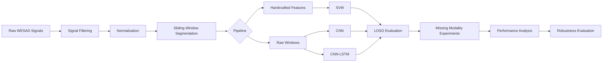

# Robust Stress Detection Under Missing Biosignal Modalities

A multimodal physiological stress detection framework that evaluates the robustness of machine learning and deep learning models under simulated sensor failures. The project investigates how missing physiological modalities affect stress classification performance using the WESAD dataset and introduces a systematic robustness evaluation protocol based on inference-time modality dropout. Three approaches are compared: a handcrafted-feature SVM baseline, a multimodal CNN, and a multimodal CNN-LSTM. Extensive Leave-One-Subject-Out (LOSO) experiments demonstrate both predictive performance and robustness under realistic wearable sensor failures.

---

## Abstract

Wearable stress detection systems generally assume that every physiological sensor remains available throughout deployment. In practice, wearable devices frequently experience sensor failures caused by electrode detachment, motion artifacts, communication loss, or battery depletion. Such failures result in missing physiological modalities that can substantially degrade model performance.

This work evaluates the robustness of multimodal stress detection systems under controlled modality dropout using the WESAD dataset. We compare a handcrafted physiological feature pipeline with Support Vector Machines against deep learning models based on multimodal CNN and CNN-LSTM architectures. Missing sensor scenarios are simulated during inference without retraining to quantify performance degradation under realistic deployment conditions.

Experimental evaluation is performed using Leave-One-Subject-Out cross-validation across fifteen subjects. In addition to conventional classification metrics, robustness is measured using a Robustness Score (RS), defined as the ratio between the Macro-F1 score obtained under missing modalities and the corresponding full-modality performance.

The results demonstrate that CNN-LSTM achieves the best overall predictive performance while providing improved robustness under missing sensor conditions. Furthermore, the experiments establish the relative importance of individual physiological modalities, identifying ECG as the most critical signal and respiration as the least sensitive modality for robust stress detection. :contentReference[oaicite:1]{index=1}

---

# Key Contributions

- Subject-independent multimodal stress detection using Leave-One-Subject-Out evaluation.
- Comparative study of handcrafted physiological features and deep neural networks.
- Systematic simulation of inference-time modality failures.
- Quantitative robustness evaluation using a Robustness Score (RS).
- Single-modality and multi-modality dropout experiments.
- Modality importance analysis based on performance degradation.
- Complete preprocessing and training pipeline for the WESAD dataset.

---

## Repository Structure

```text
.
├── data/
│   ├── raw/                  # Original WESAD dataset
│   ├── processed/            # Preprocessed 700 Hz windows
│   ├── processed_ds/         # Downsampled windows (~100 Hz)
│   └── features/             # Handcrafted physiological features
│
├── experiments/              # Shared training utilities
│
├── models/                   # CNN and CNN-LSTM implementations
│
├── notebooks/
│   ├── batch_preprocessing.ipynb
│   ├── baseline_training.ipynb
│   ├── cnn_full_loso_training.ipynb
│   ├── cnn_lstm_loso.ipynb
│   ├── missing_modality.ipynb
│   └── final_results.ipynb
│
├── results/
│   ├── figures/              # Publication-quality figures
│   ├── missing_modality/     # Robustness experiment outputs
│   ├── models/               # Saved LOSO checkpoints
│   └── *.csv                 # Evaluation metrics
│
├── requirements.txt
└── README.md
```

### Directory Overview

| Directory | Description |
|------------|-------------|
| `data/` | Raw WESAD data and processed datasets used throughout the experiments. |
| `models/` | PyTorch implementations of the multimodal CNN and CNN-LSTM architectures. |
| `experiments/` | Shared training and evaluation utilities used across notebooks. |
| `notebooks/` | Complete experimental workflow, from preprocessing to final analysis. |
| `results/` | Trained model outputs, evaluation metrics, robustness experiments and publication figures. |

---

# Dataset

## Dataset

**WESAD (Wearable Stress and Affect Detection)**

Source

https://archive.ics.uci.edu/

Description

The WESAD dataset contains synchronized multimodal physiological recordings collected during baseline, stress and amusement sessions. This project uses chest-mounted RespiBAN signals.

Physiological modalities used:

- ECG
- Electrodermal Activity (EDA)
- Respiration
- Skin Temperature

Subjects

- 15 subjects
- Subject S12 excluded

Sampling Rate

700 Hz

---

## Download

Download WESAD manually and place the extracted files under

```text
data/
└── raw/
    ├── S2/
    ├── S3/
    ├── ...
    └── S17/
```

Expected directory structure

```text
data
└── raw
    ├── S2
    │   └── S2.pkl
    ├── S3
    ├── ...
    └── S17
```

---

# Methodology

## Overall Pipeline



---

## 1. Data Preprocessing

- Label filtering
- Butterworth filtering
- Savitzky-Golay smoothing
- Per-subject Z-score normalization
- 30-second windows
- 50% overlap
- Downsampling (700 Hz → 100 Hz)

---

## 2. Feature Extraction

Handcrafted features

- ECG HRV features
- EDA tonic and phasic features
- Respiration statistics
- Temperature statistics

Total features

```
11 handcrafted features
```

---

## 3. Model Architectures

### Handcrafted Baseline

```
Signals
    ↓
Feature Extraction
    ↓
StandardScaler
    ↓
SVM
```

---

### CNN


---

### CNN-LSTM


---

## 4. Training

- Leave-One-Subject-Out Cross Validation
- Adam optimizer
- Weighted Cross Entropy
- Early stopping
- Cosine Annealing Learning Rate Scheduler

---

## 5. Evaluation

Metrics

- Accuracy
- Precision
- Recall
- Macro-F1
- AUROC
- Robustness Score (RS)

---

## 6. Missing Modality Experiments

Single Modality Dropout

- No ECG
- No EDA
- No Respiration
- No Temperature

Multi Modality Dropout

- Two missing modalities
- Three missing modalities
- Single remaining modality

---

# Experimental Setup

## Hardware

```text
CPU : Intel Core i5-13500H
GPU : TODO
RAM : TODO
```

---

## Software

```text
Python 3.11

PyTorch
NumPy
SciPy
Scikit-learn
Pandas
NeuroKit2
Matplotlib
```

---

## Hyperparameters

| Parameter | Value |
|------------|------:|
| Batch Size | 32 |
| Learning Rate | 1e-3 |
| Weight Decay | 1e-4 |
| Optimizer | Adam |
| Scheduler | Cosine Annealing |
| CNN Epochs | 50 |
| CNN-LSTM Epochs | 30 |

---

# Results

## Full-Modality Performance

| Model | Macro-F1 | AUROC | Accuracy |
|--------|---------:|-------:|----------:|
| Handcrafted + SVM | **0.875** | TODO | TODO |
| CNN | 0.849 | TODO | TODO |
| CNN-LSTM | **0.879** | TODO | TODO |

The CNN-LSTM achieved the highest Macro-F1 among the evaluated models, slightly outperforming the handcrafted SVM baseline while demonstrating superior robustness under missing-modality experiments. :contentReference[oaicite:2]{index=2}

---

## Performance Under Missing Modalities

| Missing Modality | Macro-F1 Drop (%) |
|------------------|------------------:|
| ECG | **10.51** |
| Temperature | 4.76 |
| EDA | 3.34 |
| Respiration | 1.07 |

These experiments indicate that ECG contributes the most to stress classification performance, whereas respiration has the smallest impact when removed. :contentReference[oaicite:3]{index=3}

---

## Additional Metrics

| Metric | Value |
|---------|------:|
| Precision | TODO |
| Recall | TODO |
| AUROC | TODO |
| Robustness Score | TODO |

---

# Ablation Studies

The following experiments were conducted:

- Full-modality evaluation
- Single modality dropout
- Multi-modality dropout
- Robustness Score analysis
- Modality importance ranking
- LOSO subject-wise evaluation

### Key Observations

- CNN-LSTM achieved the best overall performance.
- ECG is the most informative physiological modality.
- Respiration contributes the least under the evaluated settings.
- Learned feature representations remain comparatively robust under moderate sensor failures.

---

# Installation

```bash
git clone https://github.com/<username>/<repository>.git

cd <repository>

python -m venv .venv

source .venv/bin/activate

pip install -r requirements.txt
```

Windows

```powershell
.venv\Scripts\activate
```

---

# Running Experiments

## Preprocessing

```bash
jupyter notebook notebooks/batch_preprocessing.ipynb
```

## Train Handcrafted Baseline

```bash
jupyter notebook notebooks/baseline_training.ipynb
```

## Train CNN

```bash
jupyter notebook notebooks/cnn_full_loso_training.ipynb
```

## Train CNN-LSTM

```bash
jupyter notebook notebooks/cnn_lstm_loso.ipynb
```

## Missing Modality Evaluation

```bash
jupyter notebook notebooks/missing_modality.ipynb
```

---

# Citation

```bibtex
TODO
```

---

# License

TODO

---

# Acknowledgements

- WESAD Dataset
- NeuroKit2
- PyTorch
- Scikit-learn

## Authors

**Sankar S. Pillai**  
Undergraduate Researcher  
School of Computer Science and Engineering (SCOPE)  
VIT Chennai, India

**Martin Wills**  
School of Computer Science and Engineering (SCOPE)  
VIT Chennai, India

---

This work was carried out under our guide Dr Premsankar at the **Centre for Healthcare Advancement, Innovation and Research (CHAIR), VIT Chennai** as part of the SRIP Program conducted during May 2026 to July 2026.
